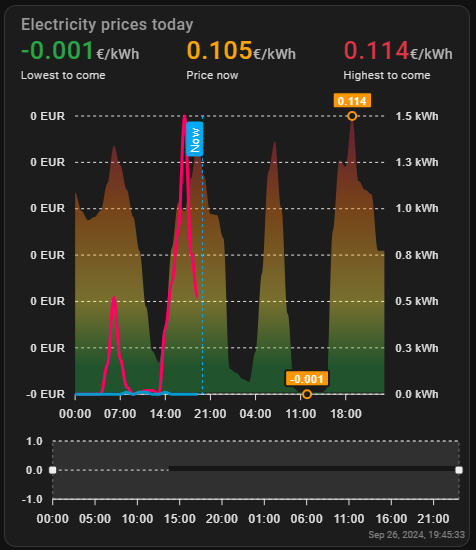

# Energy price chart using ENTSO-e Transparency Platform.

This is fork of https://github.com/TypQxQ/Sigenergy-Home-Assistant-Integration/tree/main/dashboards/nordpool_energy_chart 

KUDOS: https://github.com/TypQxQ

Chart is displaying todays prices and tomorows prices when available along with imported and exported energy.

  - Orange is upper 3:rd of the pricing interval.
  - Green is lower 3:rd of the prices interval.
  - Red is the upper 10% of the pricing interval.

# Pre-requirements

This has not been tested on HA earlier than 2024.9 and requires the following HACS addons:

- ENTSO-e - For getting energy prices. https://github.com/JaccoR/hass-entso-e
- Apex-Charts card https://github.com/RomRider/apexcharts-card
- Config Template Card Card - For scripting inside the chart card. https://github.com/iantrich/config-template-card
- lovelace-card-mod - For styling. https://github.com/thomasloven/lovelace-card-mod

# Installation
- Copy - paste the raw card codefrom `card_entsoe_energy_chart.yaml` to your a new card on you lovelace dashboard. Add any card and replace the raw code that you can edit by clicking on the *SHOW CODE EDITOR* in the bottom left.

# Configuration 

Configure your entsoe integration.

In the chart-card you should change the following variables to suit your needs:

  - Check the `entsoe` sensors names are correct.
  - The Grid `import` and `export` sensor names.
  - `currency` to whatever currency you want.
  - `decimals_in_prices` and `decimals_in_energy` to indicate how many decimals to show.

If you use anything elsse than a Sigenergy system then change all values strating with sigen to suit your needs.

--

Happy savings/ernings !:)